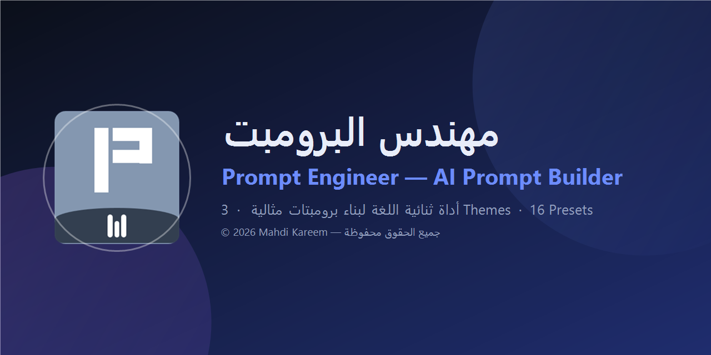

<div dir="rtl">

# 🧠 مهندس البرومبت | Prompt Engineer



> أداة عربية/إنجليزية تساعدك على بناء **برومبت (أمر) مثالي ومتكامل** بنقرات قليلة، ثم نسخه ولصقه في أي أداة ذكاء اصطناعي.

[](https://moopuu.github.io/prompt-engineer/)
[](https://github.com/MooPuu/prompt-engineer/releases)
[](./LICENSE)
[](#-الحقوق)

---

## 🌐 روابط سريعة

| الوصف | الرابط |
|---|---|
| 🌐 التشغيل على الويب (GitHub Pages) | **https://moopuu.github.io/prompt-engineer/** |
| 📂 المستودع | **https://github.com/MooPuu/prompt-engineer** |
| ⬇ تنزيل ملفات EXE الجاهزة | **https://github.com/MooPuu/prompt-engineer/releases** |

---

## ✨ المميزات

### 1) لوحة بناء من 9 أقسام
- **المهمة الأساسية** — ماذا تريد بالضبط من الذكاء الاصطناعي.
- **الدور (Role)** — من يتقمّص الشخصية (مهندس، محرر، محلل بيانات…).
- **السياق والخلفية** — معلومات المشروع/الموقف (سطر لكل نقطة).
- **الجمهور المستهدف** — لمن المحتوى.
- **النبرة والأسلوب** — **17 نبرة**: احترافي، ودّي، تعليمي، إبداعي، مختصر، مقنع، علمي، أكاديمي، ساخر ذكي، تحفيزي، أدبي شاعري، حواري، توثيقي، متفائل، مرح، متعاطف، جريء.
- **صيغة التسليم** — **14 صيغة**: Markdown، نقاط، جدول، JSON، كود، فقرات، **صورة**، HTML، CSV، SQL، إيميل، سكربت، عرض تقديمي، تقرير رسمي + الطول + لغة الإجابة.
- **القيود والمتطلبات** + **ما يجب تجنّبه**.
- **مفاتيح التحسين** و**وضع توليد الصور** (أدناه).

### 2) ثيمات ثلاث 🎨
| الثيم | الوصف |
|---|---|
| 🌙 **ليلي (Midnight)** | داكن هادئ بألوان أزرق/بنفسجي — الافتراضي. |
| ☀️ **نهاري (Light)** | فاتح عالي التباين وسهل القراءة بالكامل. |
| ⚡ **نيون (Neon)** | أسود عميق بلمسات سماوية/وردية عالية التباين. |

يُحفظ اختيارك تلقائيًا في المتصفح.

### 3) لغتان كاملتان 🌍🇸🇦
- واجهة **عربية RTL** وواجهة **إنجليزية LTR** بتبديل فوري من الشريط العلوي.
- تُترجم: العناوين، التسميات، الإرشادات، النصوص المساعدة، القوالب، معايير التقييم، الرسائل، السجل والتذييل.
- **برومبت الإخراج** نفسه يُبنى بالعربية أو الإنجليزية حسب اختيارك في "لغة الإجابة".

### 4) تقنيات هندسة البرومبت المتقدمة 🛠️
**10 مفاتيح تحسين** (قسم 8 في اللوحة) تضيف تقنيات هندسة برومبت حقيقية:
| المفتاح | الأثر |
|---|---|
| 🙋 **اسأل قبل البدء** | يمنع التخمين: النموذج يسأل سؤالًا محددًا إذا نقصت معلومة. |
| 🧩 **تفكير خطوة بخطوة** | Chain-of-Thought: تحليل قبل الإجابة → دقة أعلى في المهام المعقدة. |
| ✅ **مراجعة ذاتية** | يتحقق من استيفاء المتطلبات قبل التسليم النهائي. |
| 🎯 **أمثلة (Few-Shot)** | أمثلة مدخل/مخرج تضبط الأسلوب بدقة. |
| 🎯 **إجابة مباشرة بلا مقدمات** | يحذف "بالتأكيد!" ويبدأ بالقيمة فورًا. |
| 📎 **ذكر المصادر والمراجع** | روابط ومراجع للمعلومات غير الشائعة + تمييز الافتراضات. |
| 🧪 **2–3 بدائل ومقارنة** | جدول مزايا/عيوب لكل خيار مع توصية نهائية. |
| ⚖️ **وجهات نظر متوازنة** | الرأي المؤيد والمعارض قبل استنتاج محايد. |
| 🧒 **بسّط اللغة (ELI5)** | شرح مفهوم للمبتدئ بلا مصطلحات معقدة. |
| 🗓️ **خطة تنفيذ قابلة للقياس** | خطوات مرقّمة بمواعيد ومعايير نجاح واضحة. |

### 5) تقييم جودة مباشر 📈
دائرة نسبة مئوية + **12 معيارًا** (المهمة، الدور، السياق، الجمهور، الصيغة، الطول، النبرة، القيود، التجنّب، CoT، المراجعة الذاتية، الأمثلة).
**النقر على أي عنصر غير مكتمل ينقلك مباشرة إلى الحقل الناقص.**

### 6) أدوات الإخراج 📤
- نسخ البرومبت بزر واحد (مع حفظ تلقائي في السجل — آخر 8 برومبتات).
- تحميل كملف `.txt` أو `.md`.
- زر **✨ أكمل تلقائيًا** يملأ الحقول الناقصة بأفضل الممارسات.
- **16 قالبًا جاهزًا**: مقال/محتوى، برمجة، تحليل بيانات، تسويق، تلخيص، خطة ودراسة، ترجمة، توليد صور، إيميل، منشور سوشيال، سكربت فيديو، توليد أفكار، تحليل منافسين، أوصاف منتجات، شرح مفهوم، رد على عميل.

### 7) وضع توليد الصور 🖼️
يحوّل طلبك إلى **برومبت إنجليزي جاهز** لـ Midjourney / DALL·E / Stable Diffusion، مع:
- **25 أسلوبًا فنيًا** موزّعة على 3 مجموعات (📷 تصوير · 🖌️ فنون · 💻 رقمي و3D).
- **13 نسبة عرض** في مجموعتين (أفقي · مربع/عمودي) **+ حقل أبعاد مخصص** (مثل `7:5` أو `1920x1080`) يتجاوز الاختيار.
- سطر **Negative Prompt** قابل للتحرير + سطر جودة + الوضع المزاجي المأخوذ من النبرة.

### 8) قسم البرامج الموصى بها 🤖
في أسفل الصفحة قسم يعرض **8 برامج ذكاء اصطناعي موصى بها** لاستخدام البرومبت، ولكل برنامج **بديل مجاني مفتوح المصدر**، والنقر على البطاقة يفتح الرابطين معًا:

| البرنامج المقترح 🔗 | البديل المجاني مفتوح المصدر 🔓 |
|---|---|
| ChatGPT | [Open WebUI](https://github.com/open-webui/open-webui) |
| Claude | [LibreChat](https://github.com/danny-avila/LibreChat) |
| Gemini | [Jan](https://github.com/janhq/jan) |
| Midjourney | [Stable Diffusion WebUI](https://github.com/AUTOMATIC1111/stable-diffusion-webui) |
| GitHub Copilot | [Aider](https://github.com/Aider-AI/aider) |
| Perplexity | [Khoj](https://github.com/khoj-ai/khoj) |
| ElevenLabs | [Coqui TTS](https://github.com/coqui-ai/TTS) |
| Sora | [LTX-Video](https://github.com/Lightricks/LTX-Video) |

---

## 🧩 بنية البرومبت الناتج

كل برومبت يخرج من التطبيق منظّمًا في أقسام `##` يفهمها النموذج أفضل:

```
## الدور (ROLE)
## المهمة (TASK)
## السياق والخلفية (CONTEXT)
## الجمهور المستهدف (AUDIENCE)
## متطلبات الإخراج (OUTPUT REQUIREMENTS)
## النبرة والأسلوب (TONE)
## القيود والمتطلبات (CONSTRAINTS)
## ما يجب تجنّبه (DO NOT)
## طريقة العمل (METHOD)            ← عند تفعيل CoT / Ask
## أمثلة مرجعية (FEW-SHOT)         ← عند تفعيل الأمثلة
## معايير النجاح (SUCCESS CRITERIA)
## تعليمات أخيرة (FINAL INSTRUCTIONS)
```

---

## 🚀 طرق التشغيل

### 1) الويب (بدون تثبيت)
افتح: **https://moopuu.github.io/prompt-engineer/**

### 2) محليًا من الملفات
افتح `index.html` مباشرة في أي متصفح (يعمل بدون إنترنت ما عدا خطوط Google).

```bash
# أو عبر خادم محلي
npx serve .
```

### 3) نسخة سطح المكتب (Electron)

```bash
npm install          # تثبيت الحزم
npm start            # تشغيل التطوير
npm run build        # بناء النسخ الثلاث معًا 🔄
```

| الأمر | الناتج |
|---|---|
| `npm run build:portable` | **نسخة محمولة** — `Prompt-Engineer-Portable-v1.0.0.exe` (بدون تثبيت، تعمل من أي مكان/ USB) |
| `npm run build:nsis` | **مثبّت Setup** — `Prompt-Engineer-Setup-v1.0.0.exe` (تثبيت بمسار اختياري + اختصارات) |
| `npm run build:msi` | **مثبّت MSI** — `Prompt-Engineer-Setup-v1.0.0.msi` (مثبّت ويندوز رسمي/شركات) |
| `npm run build` | بناء الثلاثة معًا |

> ملفات البناء تُحفظ في مجلد `dist/`.
> المثبّتات موقّعة ذاتيًا (Self-signed) — قد يطلب منك Windows تأكيد التشغيل.

---

## 📁 بنية المشروع

```
prompt-engineer/
├── index.html                  # التطبيق كاملًا (HTML + CSS + JS)
├── themes.css                  # طبقة الثيمات الثلاث + الواجهة العصرية
├── prompt engineer icon.png    # أيقونة التطبيق الأصلية
├── main.js                     # Electron main process
├── package.json                # بيانات الحزمة + إعدادات البناء
├── build/
│   ├── icon.png                # أيقونة 256×256 (مربّعة)
│   └── icon.ico                # أيقونة ويندوز (Multi-size)
├── dist/                       # ناتج البناء (غير مُرفع)
├── README.md
├── LICENSE                     # MIT
└── .gitignore
```

---

## 🛠️ التقنيات

- **HTML5 / CSS3 / Vanilla JavaScript** — بدون أي إطار عمل، سهل التعديل والتطوير.
- **CSS Custom Properties** — نظام ثيمات كامل عبر متغيرات.
- **localStorage** — حفظ الثيم واللغة والسجل.
- **Electron + electron-builder** — نسخة سطح مكتب وبناء EXE/MSI.

---

## 📌 خارطة طريق مقترحة

- [ ] حفظ البرومبتات في ملفات (تصدير/استيراد JSON).
- [ ] وضع مقارنة بين مخرجات عدة نماذج.
- [ ] اختصارات لوحة مفاتيح (Ctrl+C للنسخ، Ctrl+1..3 للثيمات).
- [ ] إضافة قوالب جديدة (SEO، سير عمل، تحليل منافسين).
- [ ] نسخة محمولة باللغتين افتراضيًا حسب لغة النظام.

---

## 📄 الرخصة

هذه المشروع مرخّص برخصة **MIT** — انظر [LICENSE](./LICENSE).

---

## © الحقوق

**© 2026 Mahdi Kareem — جميع الحقوق محفوظة.**
صُنع بعناية ❤️

---

</div>

---

<div dir="ltr">

## 🇬🇧 English Summary

**Prompt Engineer** is a bilingual (Arabic/English) web + desktop app that helps you build a **perfect, complete AI prompt** in a few clicks, then copy it into ChatGPT, Claude, Gemini, Midjourney, or any other tool.

**Highlights**
- 9-section prompt builder (task, role, context, audience, tone, format, length, language, constraints, anti-patterns)
- **3 themes**: 🌙 Midnight · ☀️ Light · ⚡ Neon
- **Full bilingual UI**: Arabic (RTL) / English (LTR) with one click
- Advanced techniques: ask-before-answering, chain-of-thought, self-review, few-shot examples
- Live **quality score** with 12 checks — click an item to jump to the missing field
- 8 ready-made presets, copy / export `.txt` / `.md`, built-in history
- **Image mode** that outputs a ready-to-use English image prompt with negative prompt & aspect ratio
- Runs on the **web** (GitHub Pages) or as a **Windows app**

**Build the installers**

```bash
npm install
npm run build          # portable exe + NSIS setup exe + MSI
```

| Artifact | Description |
|---|---|
| `Prompt-Engineer-Portable-v1.0.0.exe` | Portable — no installation, run from anywhere |
| `Prompt-Engineer-Setup-v1.0.0.exe` | NSIS installer with custom path & shortcuts |
| `Prompt-Engineer-Setup-v1.0.0.msi` | Windows MSI installer |

**Web app:** https://moopuu.github.io/prompt-engineer/

**License:** MIT · **© 2026 Mahdi Kareem — All rights reserved.**
</div>
